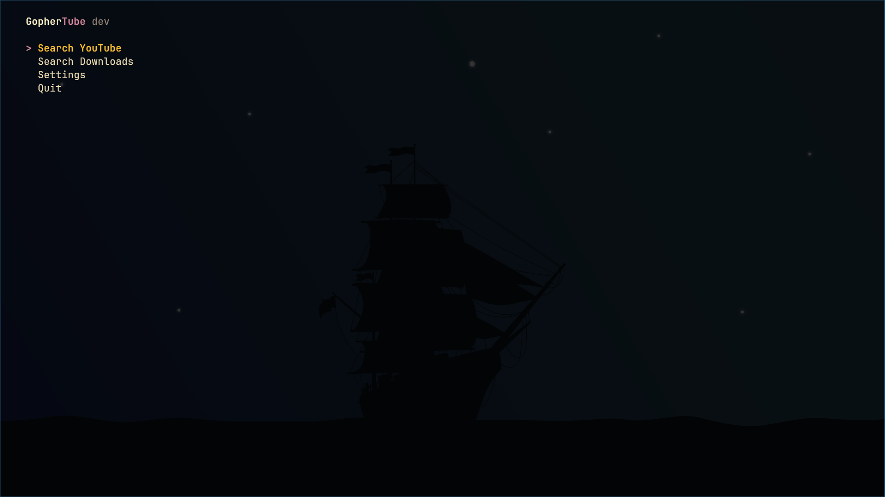
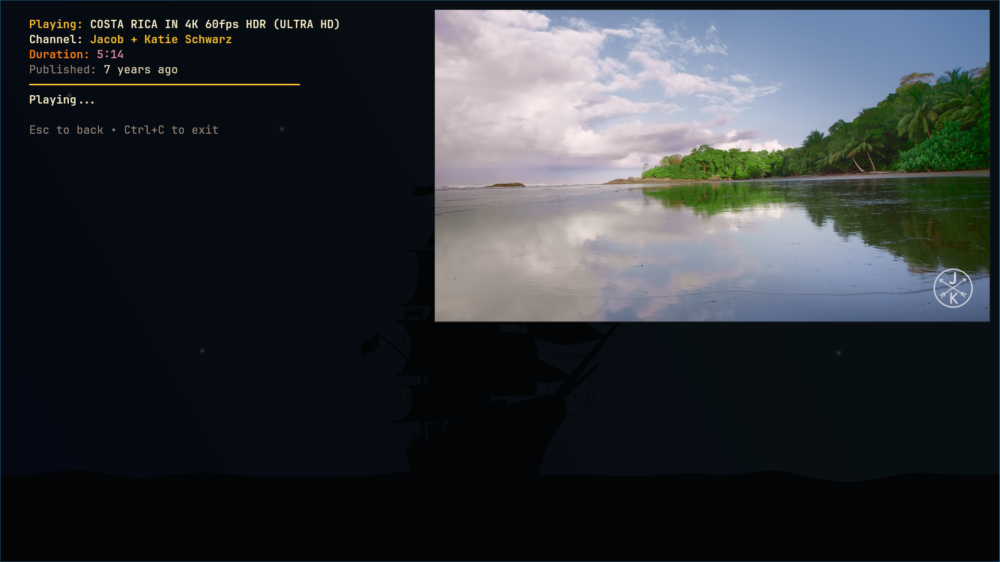

<div align="left">
  
</div>

# GopherTube

[](https://golang.org/dl/)
[](https://www.gnu.org/licenses/gpl-3.0)
[](https://github.com/KrishnaSSH/GopherTube)
[](https://github.com/KrishnaSSH/GopherTube/commits/main)
[](https://github.com/KrishnaSSH/GopherTube/graphs/contributors)
[](https://github.com/KrishnaSSH/GopherTube)
[](https://github.com/KrishnaSSH/GopherTube/issues)
[](https://github.com/KrishnaSSH/GopherTube/pulls)
[](https://github.com/KrishnaSSH/GopherTube/stargazers)

[](https://github.com/KrishnaSSH/GopherTube/releases)
[](https://github.com/KrishnaSSH/GopherTube/releases)
[](https://goreportcard.com/report/github.com/KrishnaSSH/GopherTube)
[](https://aur.archlinux.org/packages/gophertube)

<!-- Discord Button -->
<p align="left">
  <a href="https://discord.gg/TqYvzbGJzb" target="_blank">
    
  </a>
</p>

A simple terminal YouTube client for searching and watching videos using [yt-dlp](https://github.com/yt-dlp/yt-dlp) and [mpv](https://mpv.io/).


---

## Table of Contents

- [Overview](#overview)
- [Features](#features)
- [Who is this Project for?](#who-is-this-project-for)
- [Prerequisites](#prerequisites)
- [Installation](#installation)
  - [Quick Install](#installation)
  - [Manual Installation](#installation)
- [Usage](#usage)
  - [Keyboard Shortcuts](#keyboard-shortcuts)
- [Configuration](#configuration)
  - [Configuration Options](#configuration-options)
- [Troubleshooting](#troubleshooting)
- [FAQ](#faq)
- [Roadmap](#roadmap)
- [Star History](#star-history)
- [Contributing](#contributing)

## Overview

GopherTube is a tui based youtube client. It scrapes and parses the youtube website to get the metadate and uses [mpv](https://mpv.io/) to play videos. The ui is built with bubbletea, and is keyboard driven.

**Screenshots**

<p align="left">
  
  <br><em>main menu</em>
  
  <br><em>searching for videos</em>
</p>

**Demo Video**  
Watch the demo video [here](https://github.com/KrishnaSSH/GopherTube/raw/refs/heads/main/.assets/demo.mp4)


## Features

- **Fast YouTube search** (scrapes YouTube directly, no API key needed)
- Play videos with [mpv](https://mpv.io/)
- Minimal terminal UI (fzf)
- Keyboard navigation (arrows, Enter, Tab, Esc)
- TOML config
- **Download videos** with quality selection ([yt-dlp](https://github.com/yt-dlp/yt-dlp))
- **Downloads menu**: browse and play downloaded videos
- **Thumbnail preview** in downloads menu

## Who is this Project for?
- this project is for everyone who enjoys tuis,
- anyone who wants to watch videos while using low system resources. for example if you have an older or lowspec machine that struggles to run youtube in full web browser this app might help you cut down recourse usage.
---

## Prerequisites

- [Go 1.21+](https://go.dev/dl/)
- [mpv](https://mpv.io/) (media player)
- [chafa](https://hpjansson.org/chafa/) (terminal image preview)
- [yt-dlp](https://github.com/yt-dlp/yt-dlp) (YouTube downloader)

Install dependencies:

```bash
# Ubuntu/Debian
sudo apt install mpv chafa
pip install -U yt-dlp

# macOS
brew install mpv chafa yt-dlp

# Arch Linux (Aur is having shasum issues install it from the script)

yay -S gophertube
or 
yay -S gophertube-bin # for direct binary downloads
```

---

## Installation

**Quick Install (One-liner):**
```bash
curl -sSL https://raw.githubusercontent.com/KrishnaSSH/GopherTube/main/install.sh | bash
```

**Manual Installation:**
```bash
git clone https://github.com/KrishnaSSH/GopherTube.git
cd GopherTube
go build -o gophertube
./gophertube
```
---

## Usage

- Start the app: `gophertube`
- Select between Search Youtube, Search Downloads, Settings, Quit. and press enter.
- Use ↑/↓ or j/k to move, Enter to play, Tab to load more, Esc to go back to search
- mpv opens to play the selected video


---

## Configuration

Create `~/.config/gophertube/gophertube.toml`:

```toml
search_limit = 30
quality = "1080p"           # default: 1080p (options: 1080p, 720p, 480p, 360p, Audio)
downloads_path = "/home/$USER/Videos/GopherTube"  # where to save downloads
theme = "Minimal"                                 # default: Minimal (options: Minimal, Gopher, Gruvbox, etc)
```

### Configuration Options

| Key             | Type   | Default                                   | Description                                  |
|------------------|--------|-------------------------------------------|----------------------------------------------|
| search_limit     | int    | 30                                        | Max results to fetch per page/load more.     |
| quality          | string | "1080p"                                   | Preferred quality or `Audio` for audio-only. |
| downloads_path   | string | "$HOME/Videos/GopherTube"                | Directory to save downloads.                 |
| theme            | string | "Minimal"                                 | Default application theme.                   |

---

## Troubleshooting

- __mpv not launching__: verify mpv is installed and accessible from terminal.
- __No thumbnails__: ensure `chafa` is installed; some terminals may not support images.
- __yt-dlp errors__: update yt-dlp to the latest version.

## FAQ

- __Does this use the YouTube API?__ No, it scrapes the website. API key is not required.
- __Can I play audio only?__ Yes. Choose "Listen" or set quality to `Audio`.
- __Where are files downloaded?__ See `downloads_path` in config.

## Roadmap

- Configurable keybindings
- thumbnail support in the bubbletea rewrite

## Star History

<a href="https://www.star-history.com/#KrishnaSSH/GopherTube&Timeline">
 <picture>
   <source media="(prefers-color-scheme: dark)" srcset="https://api.star-history.com/svg?repos=KrishnaSSH/GopherTube&type=Timeline&theme=dark" />
   <source media="(prefers-color-scheme: light)" srcset="https://api.star-history.com/svg?repos=KrishnaSSH/GopherTube&type=Timeline" />
   
 </picture>
</a>

---

<!-- Donation Box -->
<div align="left">
  <h3>💖 Support GopherTube</h3>
  <p>If you find this project useful, consider supporting its development with crypto:</p>
  <table>
    <tr>
      <td></td>
      <td><code>bc1q78ymwmf33vr33ly8rpej7cqvr6cljjcdjf3g6p</code></td>
    </tr>
    <tr>
      <td></td>
      <td><code>ltc1qsfp4mdwwk3nppj278ayphqmkyf90xvysxp3des</code></td>
    </tr>
    <tr>
      <td></td>
      <td><code>0x6f786f482DDa360679791D90B7C8337655dC2199</code></td>
    </tr>
  </table>
</div>


## License

[](LICENSE)


---

## Contributing

PRs and issues welcome. 

See [CONTRIBUTING.md](CONTRIBUTING.md) for guidelines. 

---

